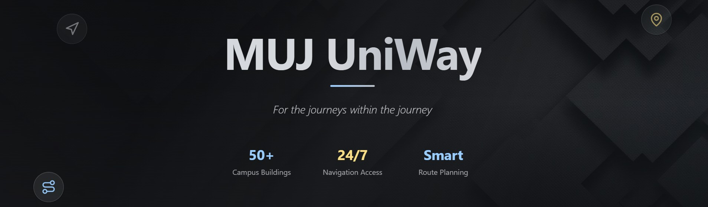

<div align="center">


  

[](https://nextjs.org/)
[](https://www.typescriptlang.org/)
[](https://reactjs.org/)
[](https://tailwindcss.com/)
[](https://nodejs.org/)
[]()

**A modern, responsive web application designed specifically for Manipal University Jaipur students and visitors. It provides comprehensive campus navigation with real-time location tracking, interactive maps, and smart routing for seamless campus exploration and enhanced student experience**


</div>


## ✨ Key Features

- 🗺️ **Interactive Campus Map** - Explore MUJ campus with detailed, interactive mapping
- 📍 **Real-time Location Tracking** - Know exactly where you are on campus
- 🧭 **Smart Navigation** - Get optimal routes to your destination
- 🎯 **Points of Interest** - Discover important campus locations easily
- 📱 **Mobile Responsive** - Access from any device, anywhere on campus
- 🌙 **Theme Support** - Dark and light mode for comfortable viewing

---

## 🚀 Quick Start

### Prerequisites

Ensure you have the following installed:
- **Node.js** (v18.0.0 or higher)
- **pnpm** (recommended) or npm
- **Git**

### Installation

1. **Clone the repository**
   ```bash
   git clone https://github.com/Samarth2190/MUJ-UniWay.git
   cd MUJ-UniWay
   ```

2. **Install dependencies**
   ```bash
   pnpm install
   # or
   npm install
   ```

3. **Set up environment variables**
   ```bash
   cp .env.local.example .env.local
   ```
   Update the `.env.local` file with your configuration values.

4. **Initialize the database**
   ```bash
   # Run the SQL scripts in order
   pnpm db:setup
   ```

5. **Start the development server**
   ```bash
   pnpm dev
   # or
   npm run dev
   ```

6. **Open your browser**
   Navigate to `http://localhost:3000` to see the application running! 🎉

---

## 🛠️ Technology Stack

### Frontend
- **⚛️ Next.js 14** - React framework for production
- **🔷 TypeScript** - Type-safe JavaScript
- **🎨 Tailwind CSS** - Utility-first CSS framework
- **📱 Responsive Design** - Mobile-first approach

### Backend & Database
- **🟢 Node.js** - JavaScript runtime
- **🗄️ Neon PostgreSQL Database** - Structured data storage
- **🔗 API Routes** - Next.js API endpoints

### Development Tools
- **📦 pnpm** - Fast, disk space efficient package manager
- **🔧 PostCSS** - CSS transformation tool
- **📋 TypeScript Config** - Strict type checking
- **🎯 ESLint & Prettier** - Code quality and formatting

### Key Integrations
- **🌍 Geolocation API** - Real-time positioning
- **🗺️ Interactive Maps** - Custom mapping solution
- **📊 Location Analytics** - User interaction tracking

---

## 📁 Project Structure

```
MUJ-UniWay/
├── 📂 app/                    # Next.js 14 App Router
│   ├── 🔐 admin/             # Admin panel pages
│   ├── 🛠️ api/               # API endpoints
│   ├── 🎨 globals.css        # Global styles
│   ├── ⚙️ layout.tsx         # Root layout
│   ├── 🔄 loading.tsx        # Loading UI
│   └── 📄 page.tsx           # Home page
├── 📂 components/             # Reusable UI components
│   ├── 🧩 ui/                # Base UI components
│   ├── 🗺️ campus-map.tsx     # Interactive campus map
│   ├── 📍 location-tracker.tsx # Location tracking
│   └── 🎨 theme-provider.tsx  # Theme management
├── 📂 hooks/                  # Custom React hooks
│   ├── 📱 use-mobile.ts      # Mobile device detection
│   └── 🍞 use-toast.ts       # Toast notifications
├── 📂 lib/                    # Utility libraries
│   ├── ⚡ actions.ts         # Server actions
│   ├── 🗄️ db.ts              # Database connection
│   ├── 🌍 geolocation.ts     # Geolocation utilities
│   ├── 🧭 navigation.ts      # Navigation logic
│   └── 🛠️ utils.ts           # General utilities
├── 📂 scripts/                # Database setup scripts
│   ├── 🏗️ 001-create-tables.sql
│   ├── 🌱 002-seed-data.sql
│   ├── 📍 003-add-coordinates.sql
│   └── 🏛️ 004-manipal-jaipur-data.sql
└── 📂 styles/                 # Styling files
    └── 🎨 globals.css        # Global CSS styles
```

---

---

## 🔧 Available Scripts

| Command | Description |
|---------|-------------|
| `pnpm dev` | 🚀 Start development server |
| `pnpm build` | 🏗️ Build for production |
| `pnpm start` | ▶️ Start production server |
| `pnpm lint` | 🔍 Run ESLint |
| `pnpm db:setup` | 🗄️ Initialize database |
| `pnpm type-check` | 🔷 Run TypeScript checks |

---

## 🤝 Contributing

We welcome contributions! Please follow these steps:

1. **Fork** the repository
2. **Create** a feature branch (`git checkout -b feature/amazing-feature`)
3. **Commit** your changes (`git commit -m 'Add amazing feature'`)
4. **Push** to the branch (`git push origin feature/amazing-feature`)
5. **Open** a Pull Request

---

## 📞 Support

If you encounter any issues or have questions:

- 🐛 **Bug Reports**: [Create an Issue](https://github.com/Samarth2190/MUJ-UniWay/issues)
- 💡 **Feature Requests**: [Start a Discussion](https://github.com/Samarth2190/MUJ-UniWay/discussions)

---

<div align="center">

### 🌟 Star this repo if you found it helpful!

**Made with ❤️ for the MUJ Community**

[](https://github.com/Samarth2190/MUJ-UniWay/stargazers)
[](https://github.com/Samarth2190/MUJ-UniWay/network)

</div>
